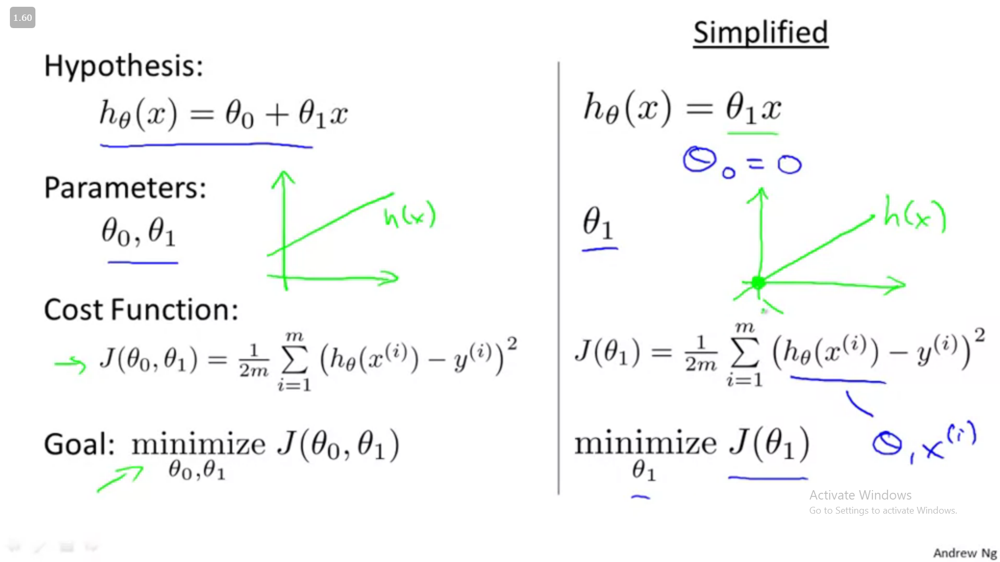
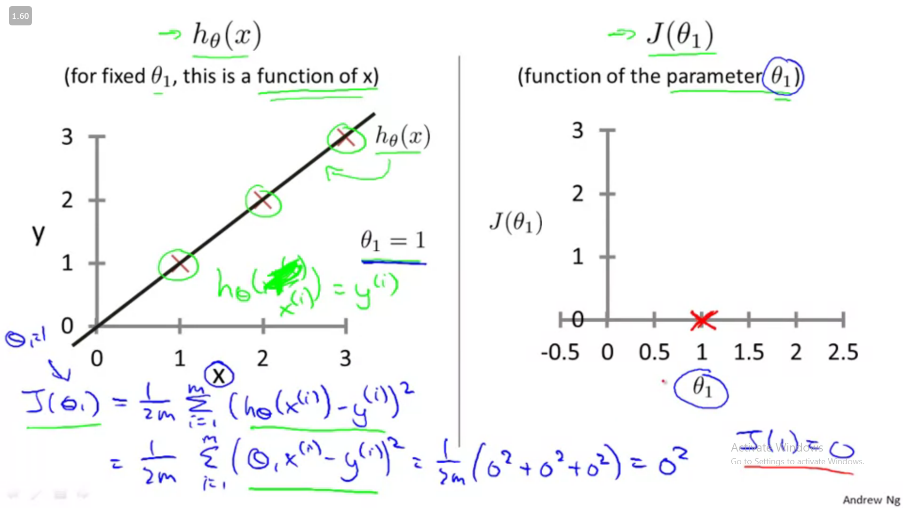
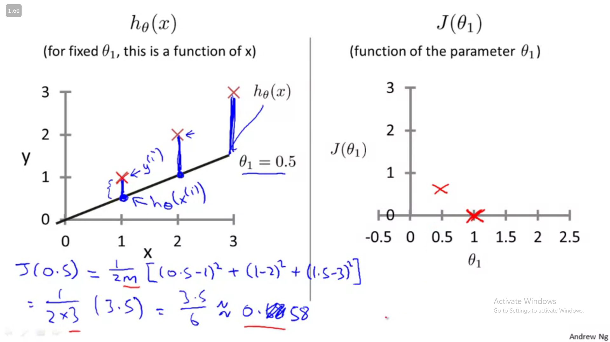
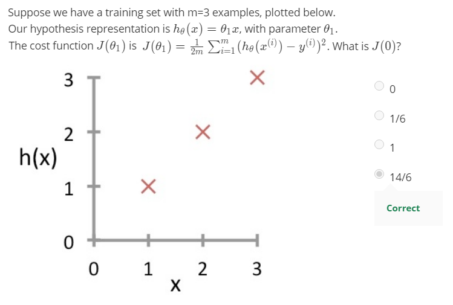
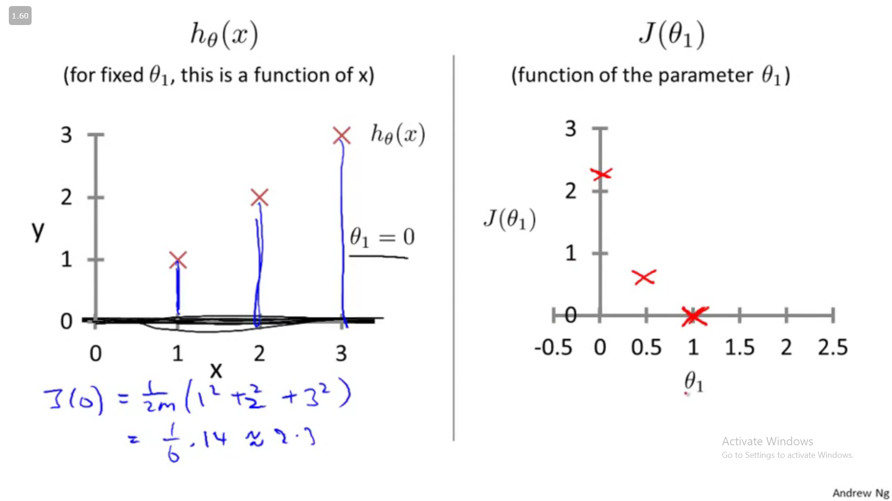
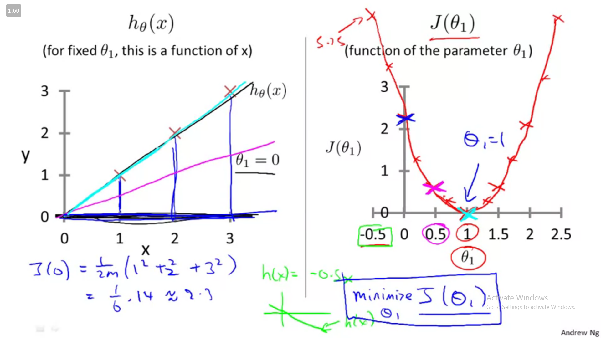

# 🤖 Machine learning

- Supervised ML
  - Regression - continous values
  - Classification - discrete values
- Unsupervised ML - here is the data set can you find some structure in the data set

## _Linear Regression_

Hypothesis - the model/function that takes input and gives output 

## <b>hθ(x) = θo + θ1x </b>==> Linear Regression with one variable  i.e y= mx + c

If you'll notice this is same as <b>y = mx + c</b> 

_So in linear regression we want to minimize_

## $\frac{1}{2m}$ $\sum\limits_{i=1}^{m}$ ( hθ ( x( i ) ) - y( i ) ) 2

where :

- **m** is the no of training examples
- **hθ ( x( i ) )** is the predicted value
- **y( i )** is the actual value  
  and the square is to get rid of negative values

---

## J( θ0 , θ1 ) is called Cost function OR squared error function

## J( θ0 , θ1 ) = $\frac{1}{2m}$ $\sum\limits_{i=1}^{m}$ ( hθ ( x( i ) ) - y( i ) ) 2

---

in the linear regression (ie straight line equation = y = mx + c) we are putting θo=0 (c =0) i.e only taking equations that pass though the origin as shown in the right side of the drawing above

## J(1)

## J(0.5)

## J(0)

---

## Plot of J(θ1 ) (i,e where )

the objective was to pick a value of θ1 that minimises J(θ1 )

here the minimum value θ1 = 1 minimises J( θ1 )  
this also corresponds to the line that best fits our data points !!
that is why we try to fit the curve  
Thus:

> minimising J( θ1 ) is the same as find a curve that fits the data well

---
